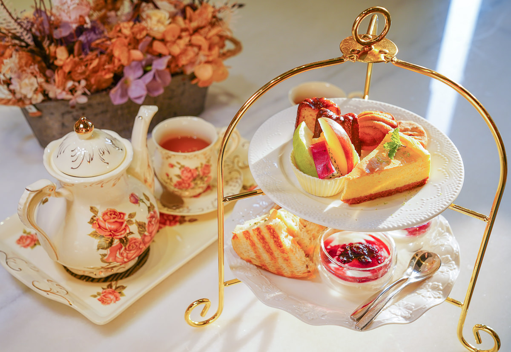

# 2021_927

## C108118126 魏冠宇

### 組員：C108118115 陳品蓉
###      C108118123 梁依玲
###      C108118146 黎安綺
###      C107118283 鄭勛文

#### 題目：     

[我的網頁](https://www.nkust.edu.tw/)




This is `text`

```
This is a long quote.
```


- [X] this is checked
- [ ] undo
- [ ] 2nd job
- [ ] 3rd job
- [ ] 4th job

Emphasis, aka italics, with asterisks or underscores.

Strong emphasis, aka bold, with **asterisks** or **underscores.**

Combined emphasis with **asterisks and underscores.**

Strikethrough uses two tildes. ~~Scratch this.~~

***
>1.First ordered list item

>2.Another item

>> ..*Unordered sub-list.
  
>3.Actual numbers don't matter, just that it's a number

>>  1.Ordered sub-list
  
>>  2.2nd
  
>4.And another item.

>>  ...*note1
  
>>  ...*note2
  
>>  ***note3
***
- [ ] todo list
- [ ] 2nd things
***   
python code
```
s = "Python syntax highlighting"
print s
```
***
javascript code
```
var s = "Javascript syntax highlighting";
alery(s);
```
***
Colons can be used to align columns.
|Tables|Are|Cool|
|:-----|:-----:|-----:|
|col 3 is|right-aligned|$1600|
|col 2 is|centered|$12|
|zebra stripes|are neat|$1|

There must be at least 3 dashes separating each header cell.

The outer pipes (|) are optional, and you don't need to make the

raw Markdown line up prettily. You can also use inline Markdown.

|Markdown|Less|Pretty|
|:------|:------:|------:|
|*Still*|```renders```|**niceky**|
|1|2|3|
